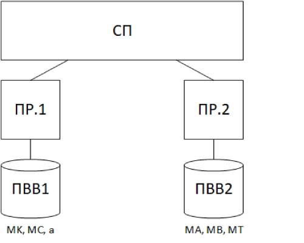
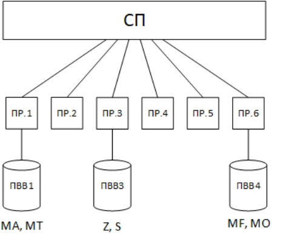

# Parallel programming  
### Practical work 7
**Task:** MA = MB * MC + a*(MK + MT)  
  
**Tools:** Ada. Semaphores.   
### Practical work 8
**Task:** A = sort(d*E + x*S(MO * MK))  
  
**Tools:** WinAPI. Semaphores, Mutex, Events, Critical Sections.   
### Practical work 9
**Task:**  A = sort(d*E + x*S(MO * MK))    
 { width: 200px; }  
**Tools:** C#  
### Practical work 10
**Task:** MA = max(Z)*(MO * MT) + min(S) * MF  
  
**Tools:** OMP   
### Practical work 11
**Task:** A = (B * C) * Z + d * S * (MO * MK)  
  
**Tools:** Ada. Protected module. 
### Practical work 12
**Task:**  A = (B * C) * Z + d * S * (MO * MK)  
  
**Tools:** Java.  
### Practical work 13  
**Task:** MA = MB + min(Z)*(MO * MK)  
  
**Tools:** Ada.   
